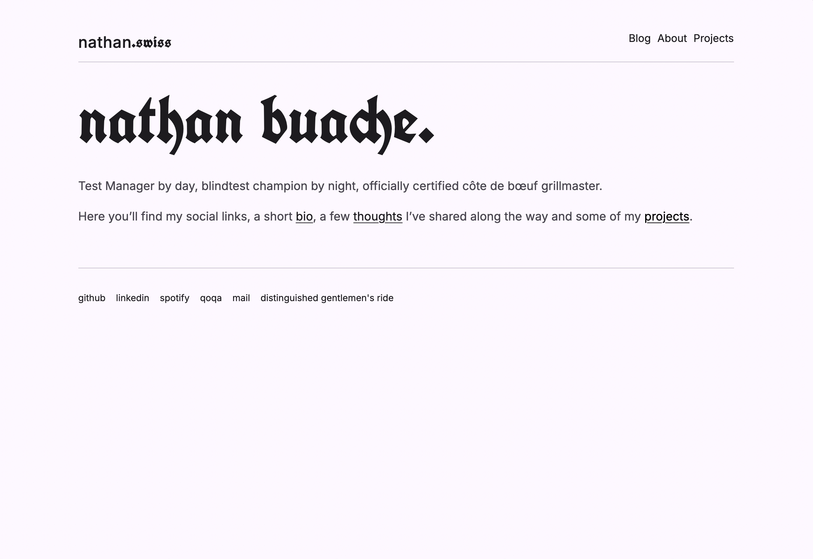

# Hugo White Paper Theme

A clean, modern Hugo theme featuring mixed Fraktur/Inter typography. Built for readability, elegance, and performance with no pagination or taxonomy bloat.

[]

## Features

- **Mixed Typography**: UnifrakturCook Fraktur combined with Inter for selective emphasis
- **No Pagination**: Clean, simple post listings without pagination complexity
- **No Taxonomies**: Streamlined without tags/categories overhead  
- **Minimalist Layout**: Pure focus on content
- **Responsive Design**: Optimized for all screen sizes
- **Fast Loading**: Lightweight and optimized assets
- **SEO Optimized**: Comprehensive meta tags, Schema.org markup, and Open Graph
- **Accessible**: WCAG compliant color contrasts and navigation

## Demo

Live demo: [nathan.swiss](https://nathan.swiss)

## Installation

### Method 1: Git Submodule (Recommended)

```bash
cd your-hugo-site
git submodule add https://github.com/nthnbch/hugo-white-paper-theme themes/hugo-white-paper-theme
```

### Method 2: Clone

```bash
cd your-hugo-site
git clone https://github.com/nthnbch/hugo-white-paper-theme themes/hugo-white-paper-theme
```

### Method 3: Download

Download the theme from GitHub and extract it to `themes/hugo-white-paper-theme`

## Configuration

Update your `config.toml`:

```toml
theme = "hugo-white-paper-theme"
title = "Your Site Name"

# Disable pagination and taxonomies for clean simplicity
disableKinds = ["taxonomy", "term"]

[params]
  # Mixed title fonts (e.g., "nathan" in Inter, ".swiss" in Fraktur)
  titlePart1 = "nathan"        # Will use Inter
  titlePart2 = ".swiss"        # Will use Fraktur
  
  # Google Analytics (optional)
  google_analytics_id = "G-XXXXXXXXXX"
  
  # Display options
  showIntroContentOnHomepage = true
  showPostsOnHomepage = false
  
  # Colors (Material Design)
  highlightColor = '#000000'
  baseColor = "#fdfbff"
  baseOffsetColor = "#f7f2fa"
  headingColor = "#1c1b1f"
  textColor = "#49454f"
  
  # Fonts
  enableGoogleFonts = true 
  googleFontsUrl = "https://fonts.googleapis.com/css2?family=Inter:wght@100;200;300;400;500;600;700;800;900&family=UnifrakturCook:wght@700&display=swap"
  fontFamilyHeading = "UnifrakturCook"
  fontFamilyParagraph = "Inter"
  fontFamilyMonospace = "Inter"
```

## Typography Features

### Mixed Title Fonts
The theme supports mixed fonts in the site title via CSS pseudo-elements:
- First part uses Inter font
- Second part uses Fraktur font
- Configure via `titlePart1` and `titlePart2` parameters

### Selective Fraktur Words
Use the `.fraktur-word` class to apply Fraktur font to specific words:

```markdown
This word is **<span class="fraktur-word">Fraktur</span>** styled.
```

### Bold Post Titles
Post titles in listings are automatically styled in bold for better hierarchy.

## Customization

### Colors

The theme uses CSS custom properties for easy color customization:

```css
:root {
  --primary: #000000;
  --on-primary: #ffffff;
  --surface: #fef7ff;
  --on-surface: #1d1b20;
  --on-surface-variant: #49454f;
}
```

Override these in `assets/css/extended/custom.css`

### Typography

Customize fonts in your `config.toml`:

```toml
[params]
  fontFamilyHeading = "Your Heading Font"
  fontFamilyParagraph = "Your Body Font"
  fontFamilyMonospace = "Your Code Font"
```

## Social Links

Add social links in `data/social.json`:

```json
{
  "links": [
    {
      "name": "GitHub",
      "url": "https://github.com/yourusername"
    },
    {
      "name": "LinkedIn",
      "url": "https://linkedin.com/in/yourusername"
    }
  ]
}
```

## License

MIT License - See [LICENSE](LICENSE) file for details

## Credits

Created by Nathan Buache  
Initially inspired by [Hugo Winston Theme](https://github.com/zerostaticthemes/hugo-winston-theme)

## Support

- [Documentation](https://github.com/nthnbch/hugo-white-paper-theme/wiki)
- [Issues](https://github.com/nthnbch/hugo-white-paper-theme/issues)
- [Discussions](https://github.com/nthnbch/hugo-white-paper-theme/discussions)
